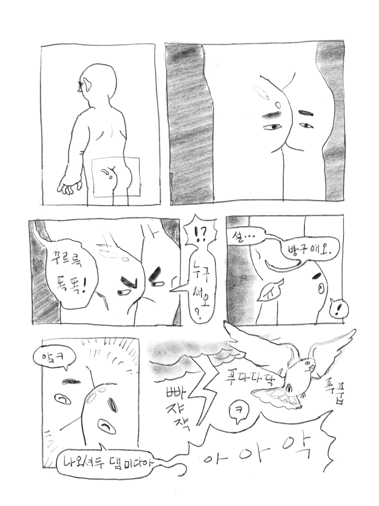

# 20171208

## 도서

(그림으로 배우는) HTTP & Network Basic / 우에노 센 씀 / 이병억 옮김 / 영진닷컴 / 978-89-314-4789-7

### march23hare가 발표를 맡은 부분

8장~9장

## marp-source directory에 대하여...

marp-source directory에 있는 md file들은 [marp](https://yhatt.github.io/marp/)로 slideshow 하기 위한 것입니다.

img directory를 바꾸면 slide에 삽입된 image가 정상 출력 되지 않을 수 있습니다.

## 외부 자료

### blog post

blog에 제가 맡은 부분의 보다 자세한 summary들이 있습니다.
[summaries](https://march23hare.github.io/categories/book-study/http-network-basic/)

### 8장 pt에 들어간 토막 만화

1. 인증이 필요한 이유

  

2. BASIC 방식 인증

  