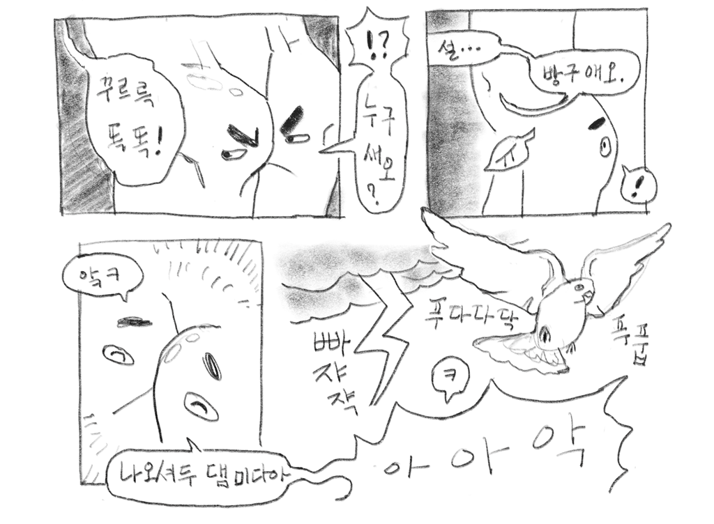
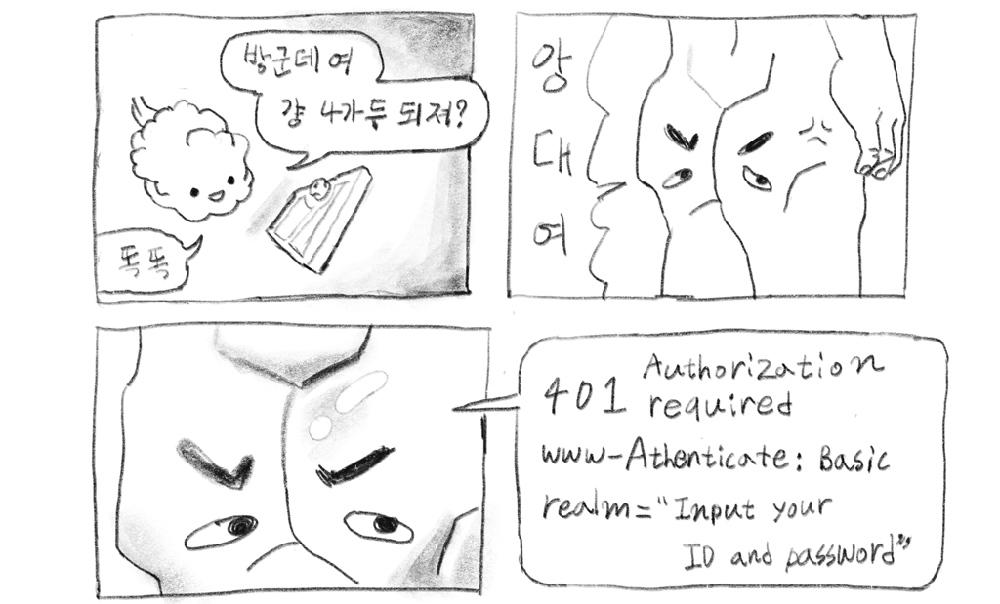

Http & Network Basic 제8장
# 누가 액세스 하고 있는지를 확인하는 인증
book study 발표를 위한 slide.

---

작성자: 임기완 march23hare@gmail.com

summary (blog post)
https://march23hare.github.io/2017/12/04/http-network-basic-1204-ch08-auth/

---

Access 대상이 주장하는 신원정보를
곧이곧대로 믿으면 안되나?

---

---

---

인증방식
- BASIC
- DIGEST
- SSL client
- form base

---

## BASIC 인증

HTTP/1.0에 구현된 protocol 자체 spec.

---

수순
1. client request: 인증 정보가 필요한 server resource를 요청
2. server response: 401 Authorization Required
3. client request: 인증 정보 포함한 resource 요청 송신
	- Authorization: scheme base64-encoded-"ID:PW"
4. server request: 200 OK. 요청된 resource 송신. 또는 401.

---

---

---

빠쟈쟉푸다닥의 음흉한 웃음, 그 이유는?
[base64encode.org](https://www.base64encode.org)

---

## DIGEST 인증

HTTP/1.1에 구현된 protocol 자체 spec.

---

수순
1. client request: 인증 정보가 필요한 server resource를 요청
2. server response: 401 Authorization Required
	- challenge code
3. client request: 인증 정보 포함한 resource 요청 송신
	- MD5 algorithm으로 challenge code와 password를 조합/계산한 암호화 code를 송신.
4. server request: 200 OK. 요청된 resource 송신. 또는 401.

---

## SSL client

HTTPS가 지원하는 spec.
주로 form base 방식과 조합(2-factor 인증).

---

### 장점
- HTTPS를 이용하기 때문에 도청이 힘듦(통신 암호화)
- HTTPS를 이용하기 때문에 완전성 보호(digital 서명)
- client에 사전 설치 된 인증서를 통해 신원 확인

---

### 단점
- 비용이 많이 듦.

---

## form base

protocol 차원에서 해주는게 없다 시피 하니 
application 차원에서 하겠다...는 취지

---

---

### 장점

- cookie를 통한 session 관리로 HTTP의 stateless 특성을 극복
- application에 맞춘 높은 수준의 보안 solution 개발 가능

---

### 단점

- 견고한 표준이 없음
- 잘 못 만들면 취약