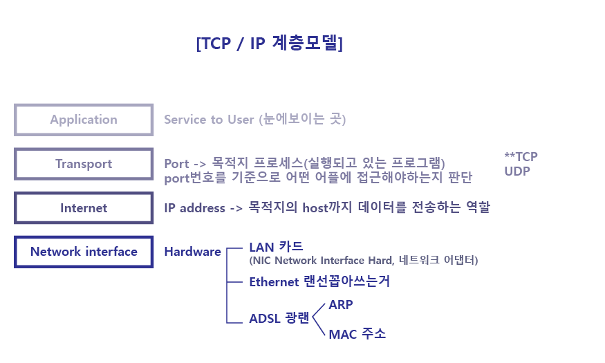
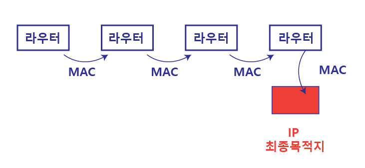
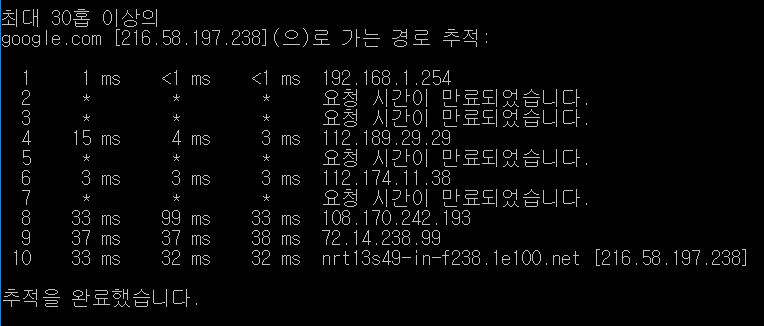

# 웹과 네트워크의 기본

## 1. HTTP란?
HyperText Transfer Protocol. 클라이언트에서 서버까지 일련의 흐름을 결정하는 프로토콜(약속)이다.

## 2. HTTP와 웹의 역사
- 1989년, HTTP 탄생. 팀버너스리가 동료들과 지식공유를위해 고안함
- 1990년, CERN(유럽 입자물리학 연구소)에서 세계 최초의 웹 서버와 웹브라우저 개발 
- 1993년, NCSA(미국 수퍼컴퓨터 연구소)에서 웹브라우저의 선조인 모자이크 개발
- 1994년, 넷스케이프사에서 Netscape Navigator1.0 출시
- 1995년, 마이크로소프트사에서 Internet Explorer1.0과 2.0출시
    - 웹서버 표준인 Apache0.2도 등장 => 웹이 약진하는 한 해였음
    - 1차브라우저 전쟁: Microsoft사와 Netscape사는 독자적으로 HTML을 확장해나가며 웹표준화를 모조리 무시함
- 2000년, Netscape사의 쇠퇴로 1차브라우저 전쟁 종료
- 2004년, 모질라 Firefox출시로 2차브라우저 전쟁 시작

-----
# 네트워크의 기본 TCP / IP
인터넷에서 서로 다른 하드웨어와 운영체제가 서로 통신 할 수 있도록 데이터를 경로를 거쳐 분산적으로 전송하고, 수신지에 도착한 데이터를 파일로 재조립되도록 하는 규칙이 있다. 이 규칙을 프로토콜이라고 부른다. 프로토콜은 여러가지가 있는데 이들을 총칭하여 TCP/IP라고 부른다.

## TCP/IP의 계층모델
> (Application) 클라이언트의 Request, HTTP메시지 작성 -> (TCP) 메시지를 통신하기 쉬운 조각으로 분해 -> (IP) 서버로 배송 -> (서버TCP) 받은 메시지 조각을 조립 -> HTTP메시지 서버에 전달 -> 지나온 순서대로 클라이언트에 Response보냄

### 1. Application 계층
- 유저에게 제공되는 곳. 유저가 어느 웹페이지를 보고싶다는 요청을 보냄
- 다양한 역할의 프로토콜이 있다.  
ex. http(web) / FTP(파일전송) / telnet, ssh(원격제어) / DNS(도메인)
- DNS (Domain Name System) 
    - 도메인 네임을 IP주소로 바꾸어 주는 프로토콜
    - DNS서버 (일명 Name server) : 도메인과 IP주소를 맵핑해서 저장해 논 것
    - 컴퓨터의 이름을 인간이 보기쉬운 단어인 도메인주소로 표기하고, 통신전 DNS서버에서 컴퓨터가 알아보기 쉬운 숫자의 조합인 IP주소로 변경해준다

### 2. Transport 계층 (TCP)
- 유저와 네트워크로 접속되어 있는 서버사이의 데이터 흐름을 제공한다.
- 유저의 요청데이터를 통신하기 쉽게 조각내어 네트워크로 접속되어있는 서버에 전달한다
- TCP & UDP : Transport계층엔 서로다른 성질의 두가지 프로토콜이 있다
    - TCP (정확성)  
    누락된 데이터가 있으면 다시요청&재전송 -> 데이터 손실이 없음
    - UDP (신속성)  
    데이터 손실이 있어도 그냥 주는대로 받음 (스트리밍, 온라인게임)  
    ex. 유튜브가 TCP이면 네트워크 상태 안좋을때 끊기면서 봐도되는데, 계속 버퍼링 걸릴 것이다

### 3. Network 계층 (IP) 
- Internet Protocol. 네트워크 상에서 데이터 배송을 담당하는 프로토콜
- IP는 MAC주소에 의존하여 통신한다
통신은 ARP프로토콜를 이용하여 MAC주소에서 한다

#### 3.1 IP 주소
Internet Protocol Address. 컴퓨터 네트워크에서 장치들이 서로를 인식하고 통신을 하기 위해서 사용하는 특수한 번호.

1. Public IP (172.168.0.0~)
    - 전세계적으로 유일무이한 주소
    - 웹서버는 퍼블릭IP
    - 사설에는 절대 퍼블릭IP 할당 X

2. Private IP (192.168.0.0~)
    - 프라이빗IP에서 외부에 있는 데이터에 접근가능하지만, 외부에선 프라이빗 IP에 접근불가.
    - LAN을 통해서는 Private IP 서로 접근가능하다

>**ISP(Internet Service Provider)**  
인터넷 접속 서비스, 웹 사이트 구축 등을 제공하는 회사 (ex. KT, U플러스..)  
-> KT에서 Public IP를 사놓고, Private로 나눠서 고객에게 IP주소를 제공해준다

#### 3.2 Mac 주소 (물리적주소)

* 인터넷이 가능한 장비(PC, 휴대폰, 공유기...)들이 가지고있는 고유번호. 
* 공장에서 만들어져 나올 때 설정하기 때문에 변경할 수 없다.
* 40-49-0-80-C3-2F --- 제조사/ 제품ID
* ex. KT와이파이에 연결 할 때, 이동통신사는 자신에게 가입된 단말기 인지 스마트폰의 MAC주소를 확인하여 판단한다

#### 3.3 IP주소와 MAC주소 
>IP -> 최종 목적지의 주소  
>MAC -> 다음에 보낼 목적지 경로에 있는 하드웨어 주소
* 라우터(router): 서로 다른 네트워크를 연결해주는 장치 (ex. 공유기, egg...)
* ARP (Address Resolution Protocol)
	* ARP는 개념적인 IP주소를 실질적인 네트워크 어댑터의 물리적 주소(MAC주소)로 변환해주는 프로토콜이다.
    * 통신은 ARP프로토콜를 이용하여 MAC주소에서 한다
    * ARP의 과정 = 브로드캐스트  
    맥주소를 알기위해 최종목적지의 IP주소를 방송하고, 랜구간에 있는 모든 호스트들의 nic는 이를 받아들여 cpu에게 분석하게해 자신의 목적지ip주소와 비교하여 일치하지 않으면 무시, 일치한다면 nic의 mac주소를 전송해준다

여러대의 컴퓨터와 네트워크기기를 거져 최종목적지(IP)에 도착.jpg

#### 예시) 구글로가는 경로 추적
10개의 라우터를 거쳤고, 10개의 MAC주소를 사용함  
`cmd창에서 > tracert google.com`

### 4. Link 계층
- 네트워크에 접속하는 하드웨어적인 면을 다룬다.
- 디바이스드라이버, NIC(Network Interface Card), 케이블등
